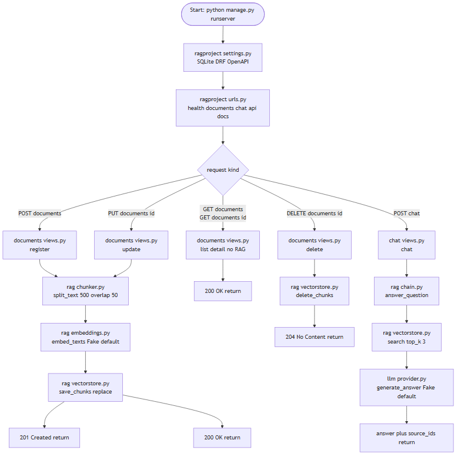
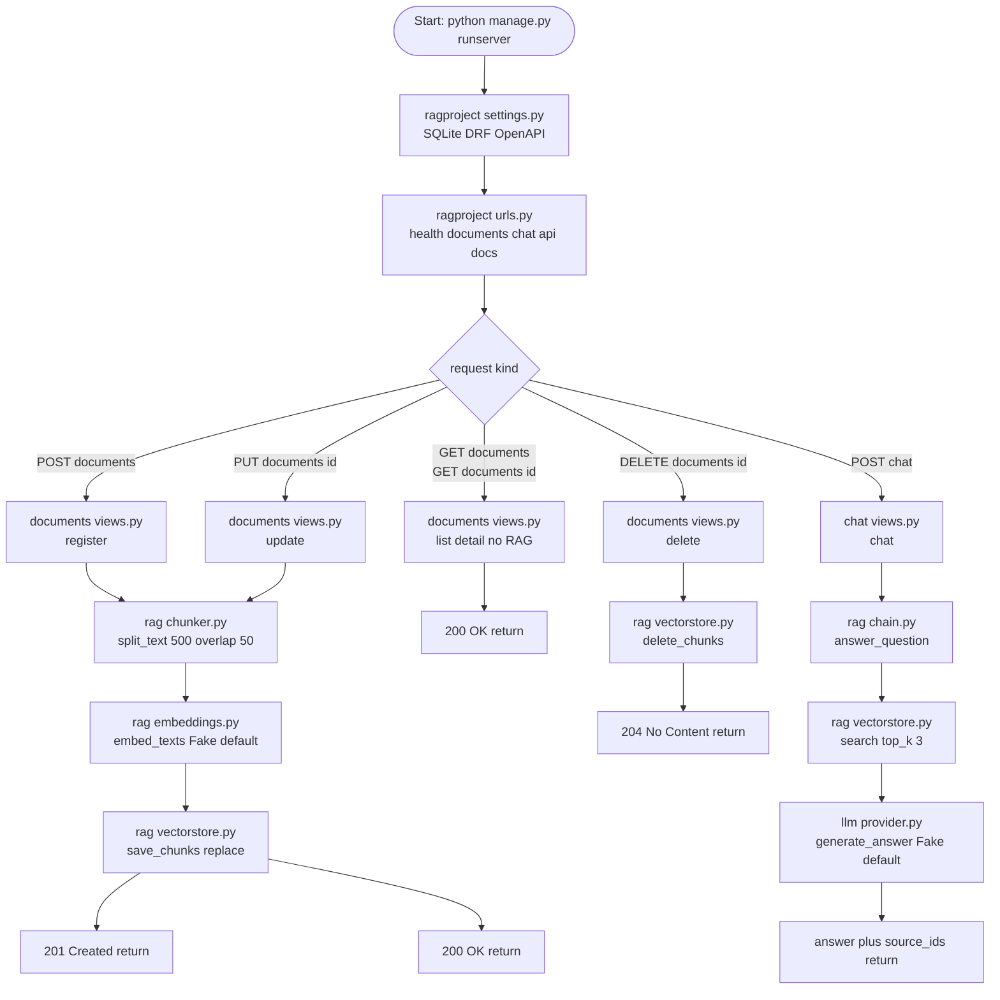

# 1. フローチャート — システム全体の処理フロー (webRagSys_Django)

## この図は何を示すか
起動から受付、分岐、RAG化、回答までの全体手順を示す。たとえるなら工場の工程図である。

## なぜ必要か
分岐先でRAG連動の有無が変わるためである。一覧詳細は書庫直読み、登録更新と質問は索引係を経由する。

## 読み方
上から下へ進む。ひし形が分岐、右側が質問応答の流れである。

## 初心者が混乱しやすい点
- POSTは201 Created、PUTは200 OK、DELETEは204 No Contentで返る。番号の意味は成功の種類の違いである
- 一覧と詳細はRAGを使わない。検索用ベクトルに触れない
- DELETEは索引削除が先である。本体先行では関連が残る
- 起動は`python manage.py runserver`である。uvicornは使わない

## 実コードとの対応
- `ragproject/urls.py:28-32`：health、documents、chat、api/schema、api/docsの振分
- `documents/views.py:93-113`：一覧・登録、登録直後にchunks再生成（55行目）
- `documents/views.py:116-141`：詳細・更新・削除、更新直後の再生成（77行目）と削除時の索引削除（139行目）
- `rag/chain.py`：answer_question（検索→整形→生成）
- `chat/views.py:66-93`：POST /chat、障害時は500

図の元データ（Mermaid）

