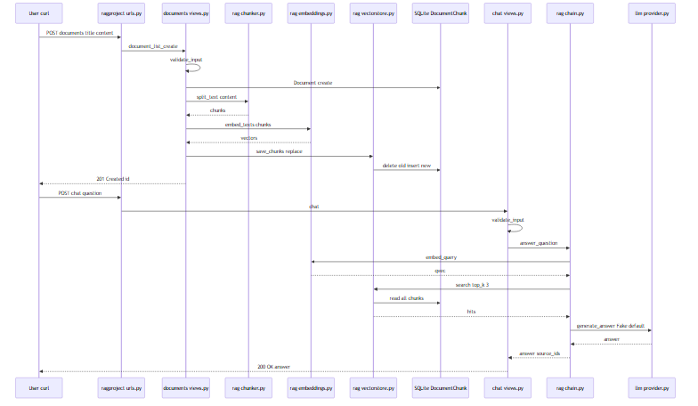
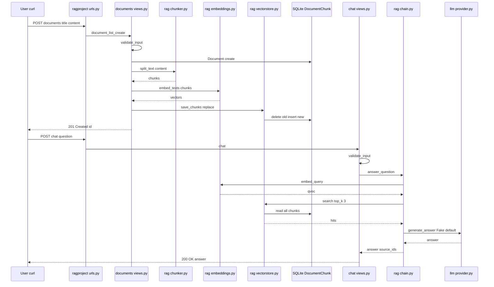

# 2. シーケンス図 — 登録と質問応答の通信 (webRagSys_Django)

## この図は何を示すか
登録時と質問時の、登場人物間の呼び出し順序を示す。たとえるなら電話の取次ぎ記録である。

## なぜ必要か
RAGは複数の関数をつなぐ仕組みであり、順序を間違えると回答の根拠が空になるためである。

## 読み方
上から下へ時間が進む。矢印が呼び出し、破線矢印が戻り値である。

## 初心者が混乱しやすい点
- 登録時にLLMは呼ばれない。分割とベクトル化だけである
- 質問時にDBへの保存は行わない。読取だけである
- `save_chunks`は置換方式である。古いベクトルを消してから入れる
- 質問のベクトル化（`embed_query`）を忘れると検索が始まらない

## 実コードとの対応
- `documents/views.py:40-56`：登録本体、保存後に分割と保存
- `rag/vectorstore.py:41-58`：置換保存、64-70行目が削除、73-90行目が検索
- `rag/chain.py`：検索→整形→生成の順序決定
- `chat/views.py:40-49`：本体はchainへの委譲だけ

図の元データ（Mermaid）

