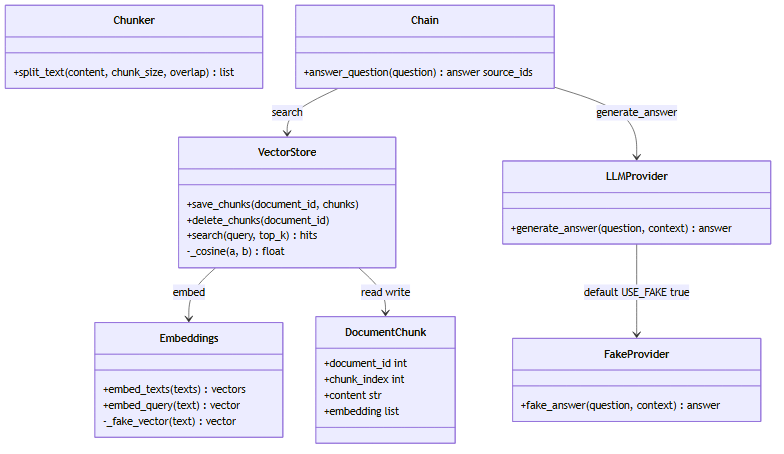
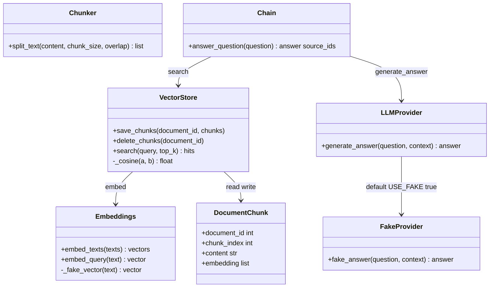

# 3a. クラス図（RAG） — 分割・検索・生成の関係 (webRagSys_Django)

## この図は何を示すか
RAGを担う部品と、その使う使われる関係を示す。たとえるなら索引係の分業表である。

## なぜ必要か
中心が`chain.py`であり、LLMがRAGを使うのではないことを明確にするためである。

## 読み方
矢印の根元が使う側、先端が使われる側である。`Chain`から3本出る。

## 初心者が混乱しやすい点
- LangChainはここでは分割道具（TextSplitter）だけである。鎖状の高度機能は使わない
- `FakeProvider`は本番の代役である。課金を避けるための偽回答係である
- `DocumentChunk`はテーブル定義であり、計算は`VectorStore`が担う
- `embedding`列はJSON列である。専用ベクトル型ではない

## 実コードとの対応
- `rag/chunker.py`：`split_text`、LangChain優先・単純分割退避
- `rag/embeddings.py`：`embed_texts`、`embed_query`、偽ベクトル8次元
- `rag/vectorstore.py:25-38`：コサイン計算、73-90行目が検索
- `rag/chain.py`：検索と生成の順序決定
- `llm/provider.py`：`USE_FAKE=true`既定で偽回答
- `documents/models.py:39-59`：`DocumentChunk`定義

図の元データ（Mermaid）

