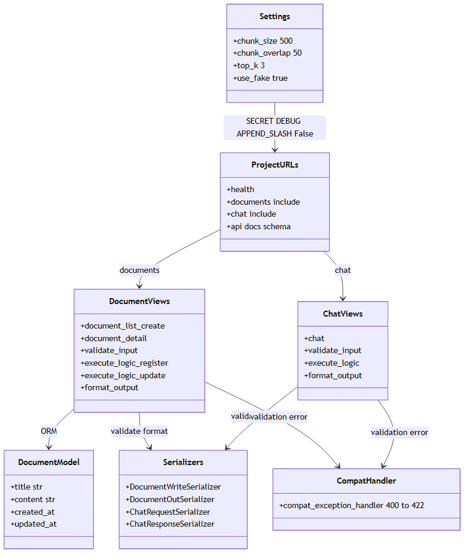
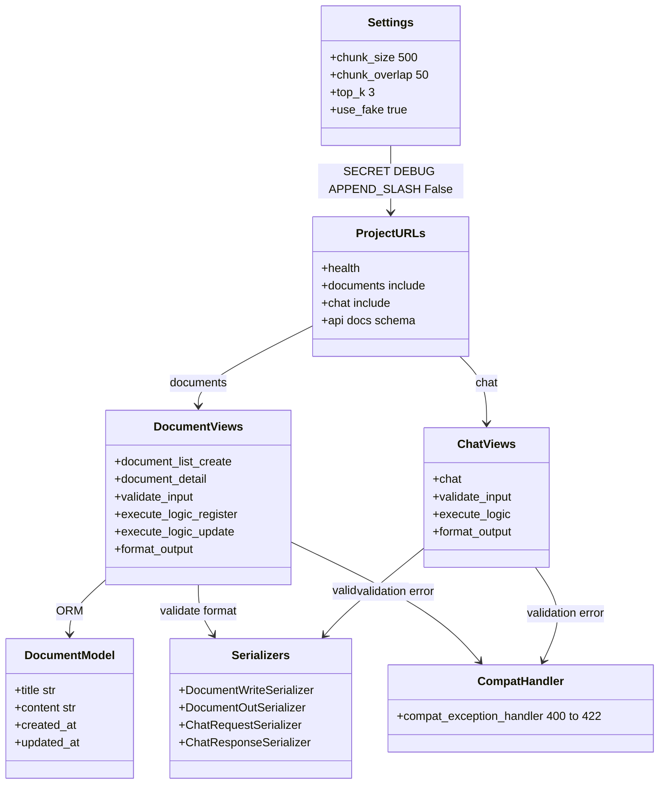

# 3b. クラス図（モジュール） — 受付・保存・設定の関係 (webRagSys_Django)

## この図は何を示すか
Django側の部品と、その使う使われる関係を示す。たとえるなら受付窓口の配置図である。

## なぜ必要か
RAG図と対にし、Djangoが担う範囲（受付と保存）を見切るためである。

## 読み方
`ProjectURLs`が入口、`DocumentViews`と`ChatViews`が振分先である。

## 初心者が混乱しやすい点
- Djangoの「アプリ」は機能の束である。`documents`と`chat`が別アプリである
- `Serializer`は検証と整形の両方を担う。Pydantic相当である
- `CompatHandler`はDRF既定の400を422に直す変換器である
- `APPEND_SLASH=False`は末尾スラッシュなし受付の宣言である

## 実コードとの対応
- `ragproject/settings.py:71-72`：SQLite指定、88行目が`APPEND_SLASH=False`
- `ragproject/settings.py:91-93`：OpenAPIと例外ハンドラ指定
- `ragproject/urls.py:28-32`：入口の振分
- `ragproject/exceptions.py`：400から422への変換
- `documents/views.py`：`validate_input`、`execute_logic`、`format_output`の3役分担
- `chat/views.py`：同上

図の元データ（Mermaid）

