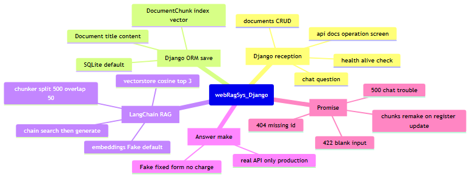
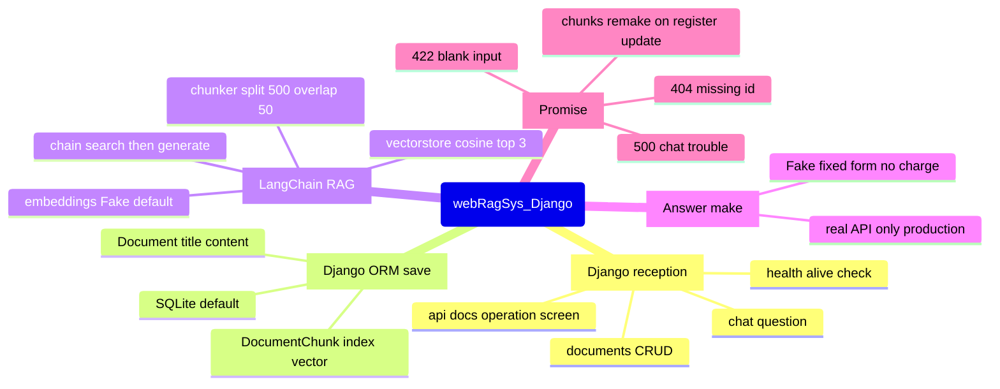

# 4. マインドマップ — 全体概念の階層 (webRagSys_Django)

## この図は何を示すか
本システムの概念全体を1枚に畳んだ階層図である。たとえるなら目次ポスターである。

## なぜ必要か
詳細に入る前に、受付・保存・RAG・回答・約束の5枝を把握するためである。

## 読み方
中心から外へ読む。枝の先が具体的な部品である。

## 初心者が混乱しやすい点
- Djangoの枝とRAGの枝は別物である。混ざらない
- 偽実装は学習用の代役である。本番の振る舞いではない
- 約束の枝（404・422・500）は仕様である。覚える対象である

## 実コードとの対応
- 受付の枝：`ragproject/urls.py`、`documents/views.py`、`chat/views.py`
- 保存の枝：`documents/models.py`
- RAGの枝：`rag/`一式
- 回答の枝：`llm/`一式
- 約束の枝：`ragproject/exceptions.py`、`documents/views.py:128行目`、`chat/views.py:84-92行目`

図の元データ（Mermaid）

