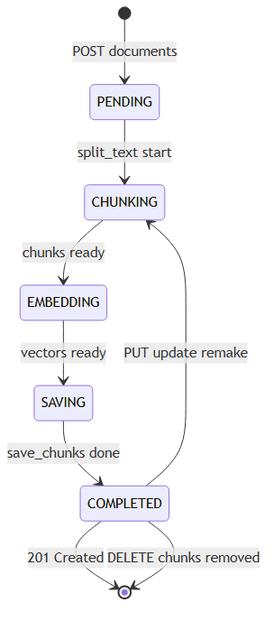
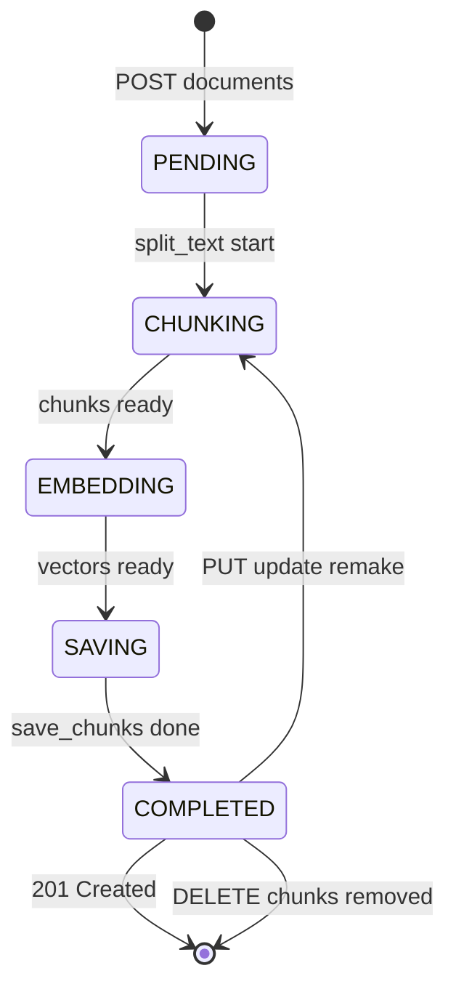

# 5. 状態遷移図 — 文書のRAG化段階 (webRagSys_Django)

## この図は何を示すか
1件の文書が登録から検索可能になるまでの段階を示す。たとえるなら索引付けの進捗札である。

## なぜ必要か
RAG化が複数段階であり、更新で作り直し、削除で消えることを示すためである。

## 読み方
丸が段階、矢印が進み方である。更新は完了から分割に戻る。

## 初心者が混乱しやすい点
- DBに状態列はない。処理の段階を表す概念図である
- 更新は差分更新ではない。全置換である
- 削除は文書と索引の両方が消える

## 実コードとの対応
- `documents/views.py:53-55`：登録から分割と保存へ
- `rag/vectorstore.py:41-58`：置換保存の本体
- `documents/views.py:73-77`：更新時の作り直し
- `documents/views.py:139-140`：削除時の索引削除

図の元データ（Mermaid）

